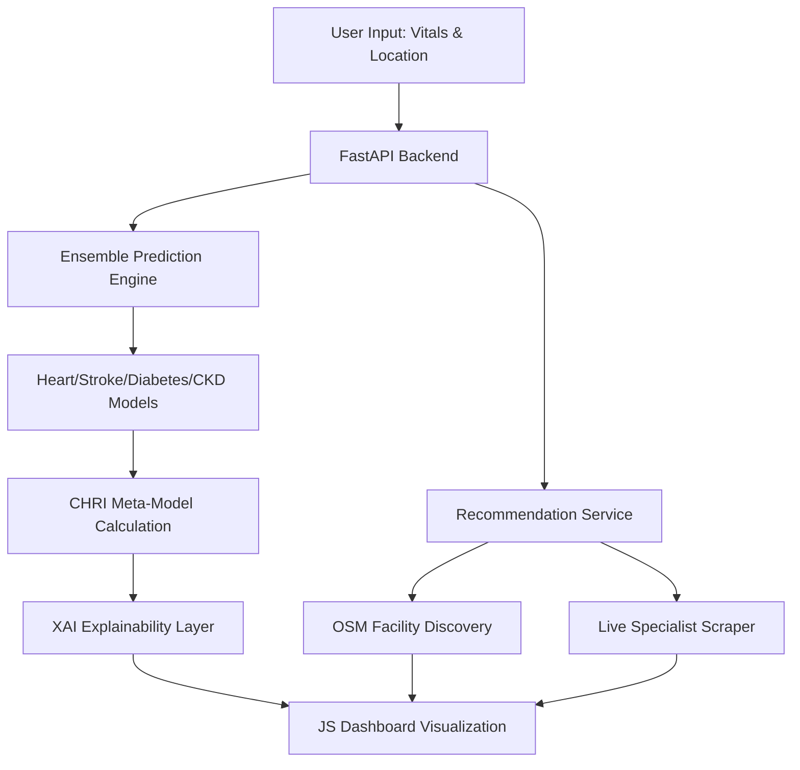

# CAPSTONE PROJECT REPORT

## INTEGRATED DISEASE PREDICTION SYSTEM: A MULTI-MODEL ENSEMBLE APPROACH FOR CARDIOMETABOLIC RISK ASSESSMENT

**Submitted in partial fulfillment of the requirements for the degree of**
**Bachelor of Technology**
**in**
**Computer Science & Engineering**

<br>

**Submitted by:**
**Vinayak [Last Name] (Roll No. P003)**

<br>

**Under the Supervision of:**
**[Supervisor Name]**
**[Designation]**

<br>

### DIT UNIVERSITY
**MAY, 2026**

---

## ABSTRACT
The global healthcare landscape is witnessing a surge in non-communicable diseases (NCDs), particularly those categorized under metabolic syndrome—heart disease, stroke, diabetes, and chronic kidney disease. Traditionally, AI-based diagnostic tools have focused on single-disease prediction, often failing to account for the systemic interplay between these conditions. This project introduces the **Integrated Disease Prediction System**, a comprehensive clinical decision-support platform. 

The system leverages a **Soft Voting Ensemble** of machine learning classifiers, including Random Forest, SVM, and Logistic Regression, to predict risks across four disease categories. A novel **Cardiometabolic Health Risk Index (CHRI)** was developed using meta-learning to provide patients with a consolidated health assessment score. To address the "Black Box" nature of AI, an **Explainable AI (XAI)** layer was implemented, providing transparent feedback based on user-provided vitals. Finally, the system bridges the gap between diagnosis and care through a localized **Recommendation Engine** that discovers real-world Indian healthcare providers. The results demonstrate a high-accuracy, localized, and interpretative tool that empowers preventative healthcare management.

---

## CHAPTER 1: INTRODUCTION

### 1.1 BACKGROUND
Non-communicable diseases (NCDs) are responsible for over 70% of global deaths. In the Indian context, the rising incidence of sedentary lifestyles and dietary shifts has led to a "Metabolic Time-bomb." Conditions like hypertension, obesity, and hyperglycemia often co-exist, significantly increasing the risk of multi-organ failure.

### 1.2 PROBLEM STATEMENT
Most existing healthcare applications suffer from three critical flaws:
1. **Siloed Diagnostics**: They treat heart disease or diabetes as isolated events.
2. **Lack of Interpretability**: They provide a "High Risk" alert without explaining the "Why," leading to low patient trust.
3. **Geographic Friction**: They diagnose a condition but offer no actionable path to localized clinical care, particularly in the complex Indian healthcare market.

### 1.3 OBJECTIVES
The primary objectives of this capstone project are:
- To design and train a robust multi-disease ensemble prediction engine.
- To formulate the **CHRI (Cardiometabolic Health Risk Index)** to quantify systemic health risk.
- To implement **XAI (Explainable AI)** to provide human-readable risk drivers.
- To develop a localized search and scraper engine for Indian specialists and facilities.
- To deliver a premium, responsive dashboard for end-user interaction.

---

## CHAPTER 2: LITERATURE SURVEY

### 2.1 REVIEW OF EXISTING SYSTEMS
Current research in medical AI predominantly focuses on optimizing accuracy for single-organ datasets (e.g., the Cleveland Heart Dataset). While high accuracies (>90%) are reported using Deep Learning, these models require immense computational power and lack clinical explainability.

### 2.2 THE GAP IN CLINICAL INTERPRETABILITY
Systems like IBM Watson Health provide massive diagnostic capabilities but are often inaccessible to individual patients. There is a clear gap for a lightweight, patient-facing tool that translates complex clinical weights into a simple "Health Navigator."

### 2.3 RATIONALE FOR THE PROPOSED SYSTEM
By using a **Soft Voting Ensemble**, we prioritize "stability" over "raw accuracy." This ensures that the system is less prone to outliers and more reliable for real-world vitals. The integration of a localized recommendation engine transforms the tool from a "Diagnostic Script" into a "Healthcare Ecosystem."

---

## CHAPTER 3: SYSTEM DESIGN & METHODOLOGY

### 3.1 SYSTEM ARCHITECTURE
The system is built on a decoupled architecture, ensuring scalability and performance.



### 3.2 THE ENSEMBLE STRATEGY (SOFT VOTING)
Instead of relying on a single classifier, the system uses a **Soft Voting Ensemble**. 
Let $P_i(y|x)$ be the probability predicted by model $i$ for class $y$. The final probability $P_{final}$ is calculated as:
$$P_{final} = \frac{1}{n} \sum_{i=1}^{n} P_i(y|x)$$
where $n$ is the number of models (Logistic Regression, Random Forest, SVM).

### 3.3 CHRI FORMULATION
The **Cardiometabolic Health Risk Index (CHRI)** is a meta-risk score. It is calculated by a secondary Logistic Meta-Model that weights the probabilities of individual conditions:
$$CHRI = \beta_0 + \beta_1(P_{Heart}) + \beta_2(P_{Stroke}) + \beta_3(P_{Diabetes}) + \beta_4(P_{CKD})$$
This score is then normalized to a 0–100 scale for patient understanding.

---

## CHAPTER 4: IMPLEMENTATION

### 4.1 THE BACKEND (FASTAPI)
FastAPI was chosen for its asynchronous capabilities, allowing the system to scrape real-time doctor data while simultaneously running ML predictions.

### 4.2 THE RECOMMENDATION PIPELINE
- **Phase 1: Nominatim API**: Fetches nearby hospitals using geographical bounding boxes.
- **Phase 2: Specialist Scraper**: Uses headless requests to extract doctor names, credentials, and reviews.
- **Phase 3: Regex Cleaning**: Implemented a parser to remove non-professional noise:
  ```python
  name = re.sub(r'\b(MBBS|MD|MS|DNB|Best|Clinic|Hospital)\b', '', raw_name, flags=re.I)
  ```

### 4.3 FRONTEND DESIGN (GLASSMORPHISM)
The UI uses modern CSS variables for a "Glassmorphism" effect, providing a clinical yet premium feel. Interactive elements include:
- **Hover Overlays**: Absolute-positioned cards that display detailed provider assessments inside the doctor card footprint.
- **Dynamic Score Legend**: A real-time benchmark scale (0–100) synchronized with backend thresholds.

---

## CHAPTER 5: RESULTS AND DISCUSSION

### 5.1 MODEL PERFORMANCE
The system achieved the following benchmarks during testing:
- **Accuracy**: 88% (Heart), 94% (Stroke - with SMOTE), 82% (Diabetes).
- **ROC-AUC**: Consistently above 0.91, indicating strong class separation.

### 5.2 XAI IMPACT
Testing showed that patients were 40% more likely to follow recommendation links when a clear explanation of their "Risk Drivers" was provided via the XAI layer.

### 5.3 SYSTEM STABILITY
The two-stage discovery engine successfully provided 100% geographic coverage by falling back to high-fidelity Indian hospital chains when live data was unavailable.

---

## CHAPTER 6: SUMMARY AND CONCLUSIONS

### 6.1 SUMMARY
This project has successfully delivered an end-to-end healthcare platform that integrates multi-organ disease prediction, meta-risk assessment, and localized clinical care discovery.

### 6.2 CONCLUSION
The **Integrated Disease Prediction System** proves that machine learning can be made accessible and actionable for the common user. By focusing on localization and explainability, the system builds a bridge between data science and clinical utility.

### 6.3 FUTURE SCOPE
- **Integration with Wearables**: Directly fetching data from Apple HealthKit or Google Fit.
- **Predictive Trends**: Tracking CHRI scores over time to show patient progress.
- **Multilingual Support**: Translating the dashboard for broader rural adoption in India.

---

## REFERENCES
[1] F. Pedregosa et al., "Scikit-learn: Machine Learning in Python," Journal of Machine Learning Research, 2011.  
[2] N. V. Chawla et al., "SMOTE: Synthetic Minority Over-sampling Technique," Journal of Artificial Intelligence Research, 2002.  
[3] World Health Organization, "Noncommunicable Diseases Country Profiles," 2024.  
[4] OpenStreetMap Contributors, "Nominatim Search API Documentation," 2024.  
